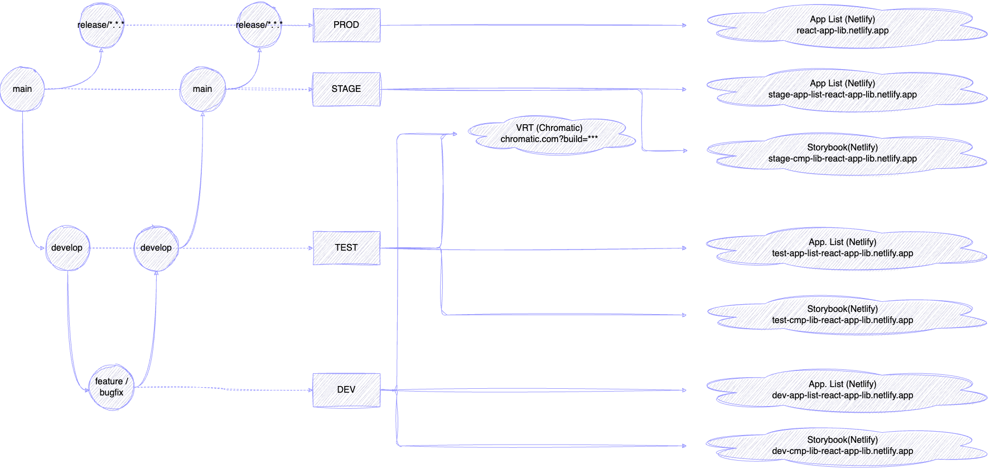

# [React Component Library (JavaScript)](https://paulalexserban.github.io/prj--reactjs-application-library/)

## Env URL's

-   [PROD Apps (AWS)](paulserban.eu/portfolio-apps/prj--reactjs-application-library)]
-   [Visual Regression Testing (Chromatic Storybook)](https://www.chromatic.com/builds?appId=65377a1a1bdfa753f1c280b8)

-   [STAGE Apps (AWS)](stage.paulserban.eu/portfolio-apps/prj--reactjs-application-library)

-   [TEST Apps (Gh. Pages)](https://paulalexserban.github.io/prj--reactjs-application-library/)
-   [TEST Storybook (Netlify)](https://test-cmp-lib-react-app-lib.netlify.app/)

-   [DEV Apps (Netlify)](https://dev-app-list-react-app-lib.netlify.app/)
-   [DEV Storybook (Netlify)](https://dev-cmp-lib-react-app-lib.netlify.app/)

## 1. Introduction

## 2. Project Structure

### 2.1 Monorepo Setup

-   **Monorepo Management**: Yarn and Lerna are used to manage the monorepo, ensuring consistent dependency versions and streamlined project scripts across packages.
-   **Atomic Design**: Used to organize components into atoms, molecules, organisms, templates, and pages.
-   **Node.js**: 18.17.1

## 3. Technology Stack

-   **Front-end**: React.js, JavaScript, SCSS
-   **Testing**: Jest for unit testing, Storybook and Chromatic for visual testing.
-   **Linting and Formatting**: Prettier, ESLint, and Stylelint.
-   **Version Control**: Git, with Husky for git hooks, Commit Lint, and Commitzen for structured commit messages.

## 4. Development and Build Tools

-   **Component Development**: Storybook for developing and documenting components in an isolated environment.
-   **Build Systems**: Custom build setups using Rollup for the component library and Parcel for the playground.

## 5. Continuous Integration and Deployment

-   **GitHub Actions**: Set up to automate testing, building, and deployment workflows.
-   **Chromatic Deployment**: Automatic deployment to Chromatic for visual regression testing and Storybook hosting.

## 6. Testing and Quality Assurance

-   **Unit Testing**: Jest is used for unit testing components and utility functions.
-   **Visual Testing**: Storybook and Chromatic are used for visual testing of components.
-   **Linting and Formatting**: Prettier, ESLint, and Stylelint are configured to ensure code consistency and quality.

## 7. Version Control and Commit Conventions

-   **Git Hooks**: Husky is configured to enforce linting and testing before commits and pushes.
-   **Commit Conventions**: Commit Lint and Commitzen are used to ensure structured and meaningful commit messages.

## 8. Root Commands / Scripts

-   `npm install -g yarn` - install yarn globally
-   `yarn install` - install dependencies
-   `yarn build:dev` - build all packages for development
-   `yarn build:prod` - build all packages for production
-   `yarn test` - run all tests
-   `yarn lint` - run all linters
-   `yarn formats:check` - check all formats
-   `yarn formats:write` - fix all formats
-   `yarn start` - start and watch all packages in development mode
-   `yarn nx graph` - show dependency graph using NX
-   `yarn commit` - commit changes using Commitizen
-   `yarn lerna version` - bump version of all packages using Lerna

## 9. Backlog

## To Do's

-   [x] Use SCSS
-   [x] Storybook
-   [x] CI/CD pipeline
-   [x] Github Pages
-   [x] unit tests
-   [x] implement husky
-   [x] implement commitlint and commitizen
-   [x] implement semantic-release
-   [x] DEV - deploy storybook to Netlify
-   [x] DEV - deploy apps to Gh. Pages
-   [ ] TEST - deploy apps to AWS Amplify
    -   [ ] setup AWS Amplify
        -   [ ] use HTTP authentication function
    -   [ ] setup AWS Route 53
-   [ ] TEST - deploy storybook to Surge.sh
-   [ ] STAGE - deploy apps to AWS S3
    -   [ ] setup AWS S3 bucket
    -   [ ] setup AWS CloudFront
        -   [ ] use HTTP authentication function
    -   [ ] setup AWS Route 53
-   [ ] PROD - deploy apps to AWS S3
-   [x] process and publish assets to AWS S3
-   [x] build and package apps in `./package/apps`
-   [ ] integration tests
-   [ ] e2e tests
-   [ ] refactor CI build for better performance (use CI for better performance)
    -   [ ] lint, formats and test
        -   [ ] -   run locally on committing for development branches
        -   [ ] -   run in CI for master branch and on pull requests to release branches
-   [ ] implement sematic release on release branch
    -   [ ] use `semantic-release` to bump version of all packages using Lerna
    -   [ ] use `semantic-release` to bump version of main project
